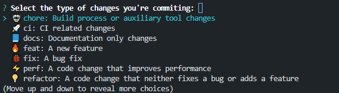

# cz-vinyl

> Commitizen adapter formatting commit messages using Vinyl Depository conventions.
> Format commit messages with [conventional commits].

cz-vinyl allows you to easily use emojis and ticket ID (JIRA, ...) in your commits using [commitizen].

[](https://www.npmjs.org/package/cz-vinyl)

[](http://npm-stat.com/charts.html?package=cz-vinyl)

```javascript
? Select the type of changes you're commiting: (Use arrow keys or type to search)
> 🤖 chore: Build process or auxiliary tool changes
  🚀 ci: CI related changes
  📘 docs: Documentation only changes
  🔥 feat: A new feature
  🐞 fix: A bug fix
  ⚡ perf: A code change that improves performance
  💡 refactor: A code change that neither fixes a bug or adds a feature
```

## Demo



## Installation

**Globally**

```bash
npm install --global cz-vinyl

# set as default adapter for your projects
echo '{ "path": "cz-vinyl" }' > ~/.czrc
```

**Locally**

```bash
npm install --save-dev cz-vinyl
```

Add this to your `package.json`:

```json
"config": {
  "commitizen": {
    "path": "cz-vinyl"
  }
}
```

## Usage

```sh
$ git cz
```

## Configuration

Like commitizen, you can specify the configuration of cz-vinyl through various options.
Configuration can be set in environment variables or in the following files:

-   a `package.json` property: `"czvinyl": {...}`
-   a `.czvinylrc` file in JSON or YAML format
-   a `.czvinylrc.json`, `.czvinylrc.yaml`, `.czvinylrc.yml`, `.czvinylrc.js`, or `.czvinylrc.cjs` file
-   a `czvinyl.config.js` or `czvinyl.config.cjs` CommonJS module exporting an object

The default commit types, descriptions and emoji that are used are:

```json
[
	{
		"description": "Build process or auxiliary tool changes",
		"emoji": "🤖",
		"value": "chore"
	},
	{
		"description": "CI related changes",
		"emoji": "🚀",
		"value": "ci"
	},
	{
		"description": "Documentation only changes",
		"emoji": "📘",
		"value": "docs"
	},
	{
		"description": "A new feature",
		"emoji": "🔥",
		"value": "feat"
	},
	{
		"description": "A bug fix",
		"emoji": "🐞",
		"value": "fix"
	},
	{
		"description": "A code change that improves performance",
		"emoji": "⚡",
		"value": "perf"
	},
	{
		"description": "A code change that neither fixes a bug or adds a feature",
		"emoji": "💡",
		"value": "refactor"
	},
	{
		"description": "Create a release commit",
		"emoji": "🔖",
		"value": "release"
	},
	{
		"description": "Markup, white-space, formatting, missing semi-colons...",
		"emoji": "🎨",
		"value": "style"
	},
	{
		"description": "Adding missing tests",
		"emoji": "✅",
		"value": "test"
	}
]
```

| Environment variable       | Key                   | Type       | default                                                       | Description                                                                |
| :------------------------- | :-------------------- | :--------- | :------------------------------------------------------------ | :------------------------------------------------------------------------- |
| `CZ_HEADER_FORMAT`         | `headerFormat`        | `string`   | `{type}: {emoji} [{ticket_id}] {subject}`                     | How the commit header will be formatted. Support: `type`, `scope`, `emoji`, `ticket_id`, `subject`
| `CZ_COMMIT_TYPES`          | `commitTypes`         | `{ value: string; description: string; emoji?: string }[]`    | Above                                                         | The commit types to work with. Only `value` and `description` are required |
| `CZ_MAX_COMMIT_LINE_WIDTH` | `maxCommitLineWidth`  | `number`   | `72`                                                          | Wraps the commit body message with max line width                          |
| `CZ_TYPE_QUESTION`         | `typeQuestion`        | `string`   | `Select the type of changes you're commiting:\n`              | The CLI question for type                                                  |
| `CZ_SCOPE_QUESTION`        | `scopeQuestion`       | `string`   | `Specify a scope:`                                            | The CLI question for scope                                                 |
| `CZ_SKIP_SCOPE`            | `skipScope`           | `boolean`  | `true`                                                        | Whether to prompt the user to a scope question                             |
| `CZ_SCOPES`                | `scopes`              | `string[]` | `[]`                                                          | Available scopes (empty array allows free text)                            |
| `CZ_TICKET_ID_QUESTION`    | `ticketIdQuestion`    | `string`   | `Type the JIRA Id (ex. V-12345):`                             | The CLI question for ticket ID                                             |
| `CZ_SKIP_TICKET_ID`        | `skipTicketId`        | `boolean`  | `false`                                                       | Whether to prompt the user to a ticket ID question                         |
| `CZ_TICKET_ID_REGEX`       | `ticketIdRegex`       | `string`   | `((?<!([A-Z]{1,10})-?)[A-Z]+-\d+)`                            | A string represents a valid RegEx to extract ticket ID from the branch     |
| `CZ_SUBJECT_QUESTION`      | `subjectQuestion`     | `string`   | `Write a short, imperative mood description of the change:\n` | The CLI question for subject                                               |
| `CZ_SUBJECT_MAX_LENGTH`    | `subjectMaxLength`    | `number`   | `70`                                                          | Max length of the subject text                                             |
| `CZ_SUBJECT_MIN_LENGTH`    | `subjectMinLength`    | `number`   | `3`                                                           | Min length of the subject text                                             |
| `CZ_BODY_QUESTION`         | `bodyQuestion`        | `string`   | `Provide a longer description of the change:\n`               | The CLI question for body                                                  |
| `CZ_SKIP_BODY`             | `skipBody`            | `boolean`  | `false`                                                       | Whether to prompt the user to a body question                              |
| `SKIP_BREAKING_CHANGES`    | `skipBreakingChanges` | `boolean`  | `true`                                                        | Whether to prompt the user to a breaking change question                   |
| `CZ_ISSUES_QUESTION`       | `issuesQuestion`      | `string`   | `List any issue closed (#1, #2, ...):`                        | The CLI question for issues                                                |
| `CZ_SKIP_ISSUES`           | `skipIssues`          | `boolean`  | `true`                                                        | Whether to prompt the user to a issues question                            |

## Examples

-   [landing-page](https://github.com/Vinyl-Depository/landing-page)
-   [cz-vinyl](https://github.com/Vinyl-Depository/cz-vinyl)

## Support

For support, email dev@vinyldepository.com or open an issue at [cz-vinyl issues](https://github.com/Vinyl-Depository/cz-vinyl/issues).

## Contributing

Contributions are always welcome!

See `CONTRIBUTING.md` for ways to get started.

Please adhere to this project's `CODE_OF_CONDUCT.md`.

## Authors

-   [@tal-rofe](https://github.com/tal-rofe)

## License

[MIT](https://choosealicense.com/licenses/mit/)

[conventional commits]: https://www.conventionalcommits.org
[commitizen]: https://github.com/commitizen/cz-cli
